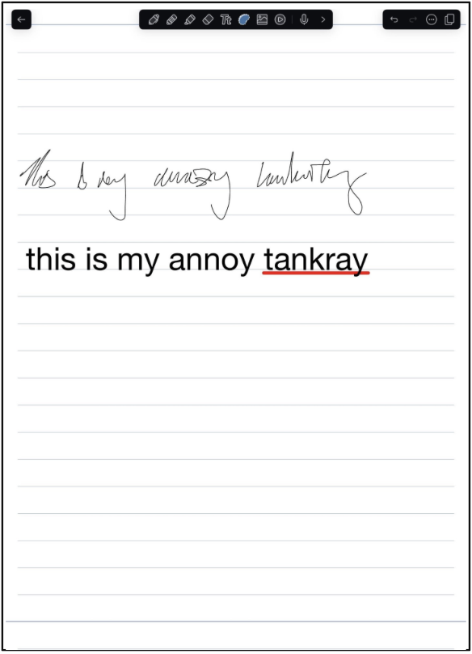
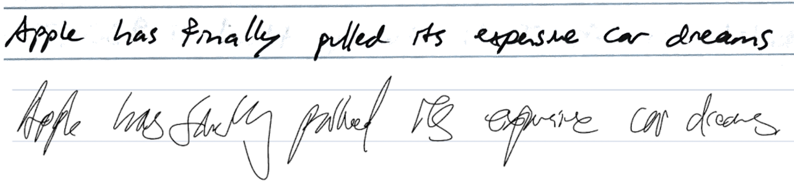
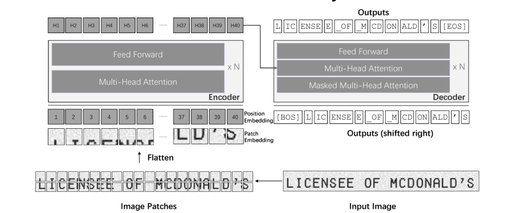
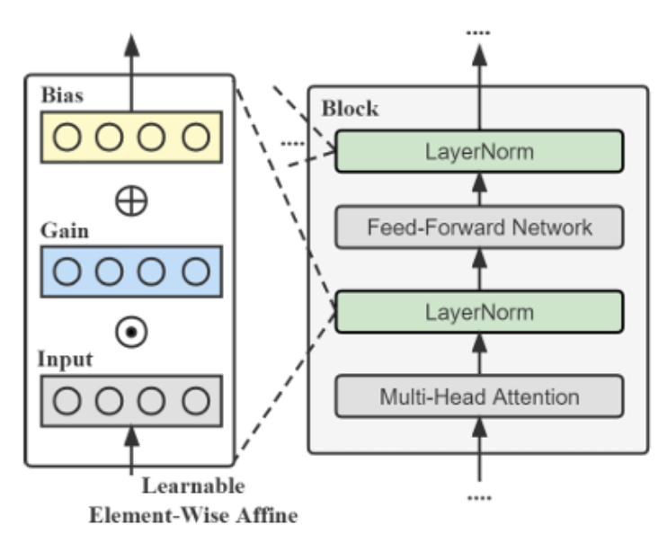
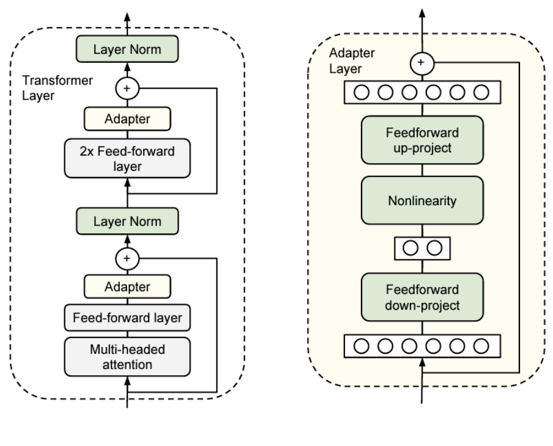
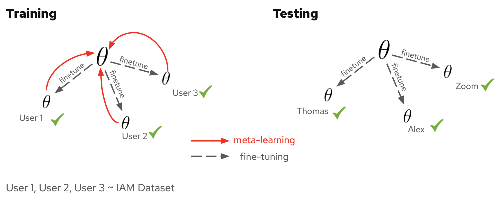

<!---
layout: default
-->

# Problem Statement

## Background
Digital writing has seen a signficant rise amongst students, academics, and buisness professionals due to the data process capabilities of tablets and imrpoved precision on styluses. Taking notes on a tablet provides allows users to easily organize, share, and search their notes. The search function in particular makes use of a technology called optical character recognition or OCR. OCR models leverage tools from computer vision and machine learning such as convolutional neural network and vision transformers. Furthermore, these methods can acurately classify a user's handwritting... unless your name is Thomas Zeng. 

<!---  -->

<!---  

  
  
Title text

-->

## Project Goal
Thomas uses his iPad and a popular app called notability to manage the notes he takes. However, because of his unusually messy handwriting, notability's built in OCR model cannot recognize his handwriting meaning he cannot search his notes. This problem isn't specific to notability, other sophisticated OCR models also fail to recognize Thomas' handwriting. While handwriting recognition is considered to be a solved problem, we argue that our problem is more difficult because it is not “well defined”, in the sense that it is hard for humans to recognize what Thomas writes.
Being the good friends we are, we made our project goal to create a model that could recognize his writing along. More broadly, our goal is to design a handwriting recongition system that superseeds human capabilities. To do this we tried 5 unique approaches to build such a model.

## Datasets
To represent Thomas' handwriting, we created a dataset of 60 images of sentences he had written. We used 50 of these images across our different training approaches and 10 for testing. As a control we create a second dataset comprised of Alex's handwriting for the same sentences which is much easier to read. 

We wanted to keep the datasets we created relatively small to limit the amount data a user with messy handwriting would need to provide to get an adapted model. To mitigate this restriction we used data augmentation to increase the diversity of our data, mainly through random rotaions and amounts of gaussian blurring. However, some of our methods required a larger volume of data along with text from a large pool of writers. For these purposes, we used the IAM dataset, which is composed of ~10,000 lines of text from hundreds of unique writers.

## Evaluation Metrics

To evaluate each of our approaches we used the character error rate or CER of our predictions. CER is a common metric in natural language processing tasks and is a measure of what percent of the sentence did the model correctly predict. Because a model has the capacity to make predictions far longer than the true label, the CER can be arbitrarily large for poor predictors. For reference many OCR models achieve a CER of around ~0.02. However, on Thomas' handwriting, some of these same models had a CER > 1.

## Approch 1 Naive Finetuning

Our first approach was to take a modern OCR model and fine-tune it on Thomas' handwriting with the hope that the model could adapt quickly. We settled on TrOCR, a transformer based OCR model that had been trained on the IAM dataset [2]. Below is a graphic taken from [2] outlining the transformer architecture of TrOCR.

In order to enable more efficient fine-tuning we also ran experiments where we frooze all of the weights in the encoder and kept the decoder weigths trainable. We also varied the number of images used in fine-tuning to see how much data was needed to adapt to a new writer.

    <table style="width: 50%; flex: 1;">
        <tr>
            <th>Finetuned on</th>
            <th>Dataset</th>
            <th>CER</th>
        </tr>
        <tr>
            <td>None</td>
            <td>Thomas</td>
            <td>5.06</td>
        </tr>
        <tr>
            <td>Entire model</td>
            <td>Thomas</td>
            <td>0.84</td>
        </tr>
        <tr>
            <td>Decoder only</td>
            <td>Thomas</td>
            <td>0.65</td>
        </tr>
        <tr>
            <td>None</td>
            <td>Alex</td>
            <td>3.10</td>
        </tr>
        <tr>
            <td>Entire model</td>
            <td>Alex</td>
            <td>0.79</td>
        </tr>
        <tr>
            <td>Decoder</td>
            <td>Alex</td>
            <td>0.34</td>
        </tr>
    </table>

    <table style="width: 50%; flex: 1;">
        <tr>
            <th># of Images</th>
            <th>Best CER (Thomas)</th>
        </tr>
        <tr>
            <td>50</td>
            <td>0.65</td>
        </tr>
        <tr>
            <td>20</td>
            <td>0.89</td>
        </tr>
        <tr>
            <td>10</td>
            <td>0.92</td>
        </tr>
        <tr>
            <td>5</td>
            <td>1.74</td>
        </tr>
        <tr>
            <td>1</td>
            <td>2.62</td>
        </tr>
    </table>

<!---
| Header 1 | Header 2 | Header 3 | 
|----------|----------|----------|
| Cell 1   | Cell 2   | Cell 3   |
| Cell 4   | Cell 5   | Cell 6   |

| Header 1 | Header 2 | Header 3 |
|----------|----------|----------|
| Cell 1   | Cell 2   | Cell 3   |
| Cell 4   | Cell 5   | Cell 6   | -->

The results shown above demonstrate that Thomas' dataset is both visually more difficult for humans and quantitatively more difficult for the OCR model than Alex's dataset. We also see that freezing the encoder facilitates more efficient fine-tuning in all instances. However, the performance is still far away from what we would hope for in an OCR model.

## Approch 2 Supervised domain adaptation

The above figure is borrowed from [4].

## Approch 3 Transfer learning

The above figure is borrowed from [1].

## Approch 4 Dual-decoder

## Approch 5 Meta learning

Another idea we considered was to think of classfying writing from different writers as related yet distinct tasks. This led us to adopt the paragdigm of meta-learning where the goal is to train a model that learns traits across similar tasks which are then leveraged when adapting to a specific task. The motivation for doing this was realizing that letters for different writers can vary but should be somewhat consistent across all text for a particular writer. For example an 'a' may look different in Thomas' dataset and in Alex's dataset but all the 'a's in Thomas' dataset should look similar. Thus, it may be more important to learn parameters which can be easily adapted to different writers than one set of parameters that performs best across all writers. 

To leverage writing samples from a variety of writers we applied MAML [3] to the IAM dataset. The idea of how we want to use meta-learning is shown in the above figure adapted from [3]. Below we have the results obtained from applying MAML to TrOCR.

    <table style="margin-left: auto; margin-right: auto;">
        <tr>
            <th>Checkpoint</th>
            <th>Dataset</th>
            <th>CER</th>
        </tr>
        <tr>
            <td>Original TrOCR checkpoint</td>
            <td>Thomas</td>
            <td>5.06</td>
        </tr>
        <tr>
            <td>Original TrOCR checkpoint (with finetuning)</td>
            <td>Thomas</td>
            <td>0.84</td>
        </tr>
        <tr>
            <td>MAML checkpoint (with finetuning)</td>
            <td>Thomas</td>
            <td>0.78</td>
        </tr>
        <tr>
            <td>Original checkpoint (with finetuning decoder)</td>
            <td>Thomas</td>
            <td>0.65</td>
        </tr>
        <tr>
            <td>MAML checkpoint (with finetuning decoder)</td>
            <td>Thomas</td>
            <td>0.51</td>
        </tr>
        <tr>
            <td>Original TrOCR checkpoint</td>
            <td>Alex</td>
            <td>3.10</td>
        </tr>
        <tr>
            <td>Original TrOCR checkpoint (with finetuning)</td>
            <td>Alex</td>
            <td>0.79</td>
        </tr>
        <tr>
            <td>MAML checkpoint (with finetuning)</td>
            <td>Alex</td>
            <td>0.77</td>
        </tr>
        <tr>
            <td>Original checkpoint (with finetuning decoder)</td>
            <td>Alex</td>
            <td>0.34</td>
        </tr>
        <tr>
            <td>MAML checkpoint (with finetuning decoder)</td>
            <td>Alex</td>
            <td>0.26</td>
        </tr>
    </table>

## Analysis

## References
[1] Houlsby, Neil, et al. "Parameter-efficient transfer learning for NLP." International conference on machine learning. PMLR, 2019.

[2] Minghao Li et al. “Trocr: Transformer-based optical character recognition with pre-trained models”. In: Proceedings of the AAAI Conference on Artificial Intelligence . Vol. 37. 11. 2023, pp. 13094–13102.

[3] Finn et al. 2017. Model-Agnostic Meta-Learning for Fast Adaptation of Deep Networks.

[4] Qi, Wang, et al. "Parameter-efficient tuning on layer normalization for pre-trained language models." arXiv preprint arXiv:2211.08682 (2022).
