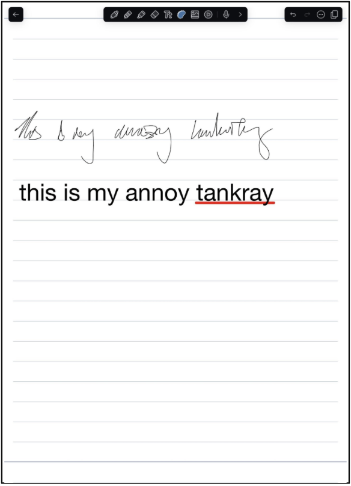
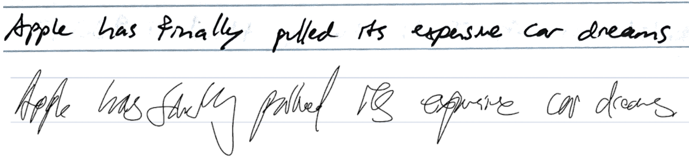
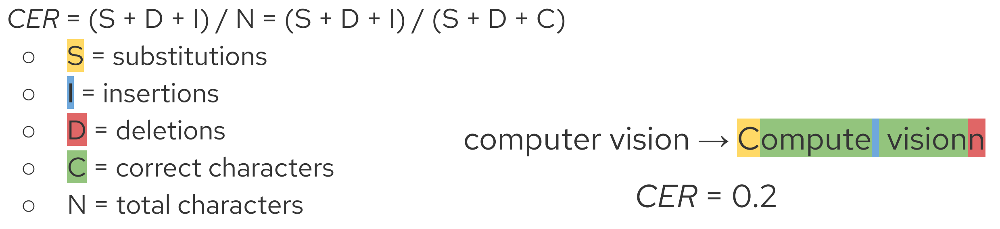
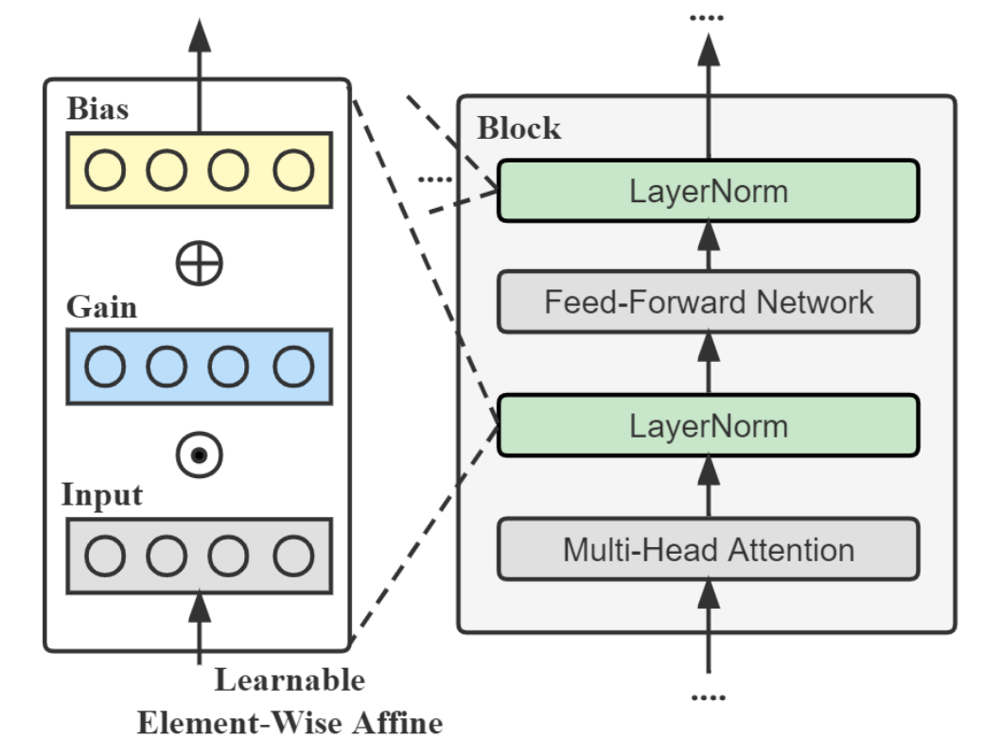
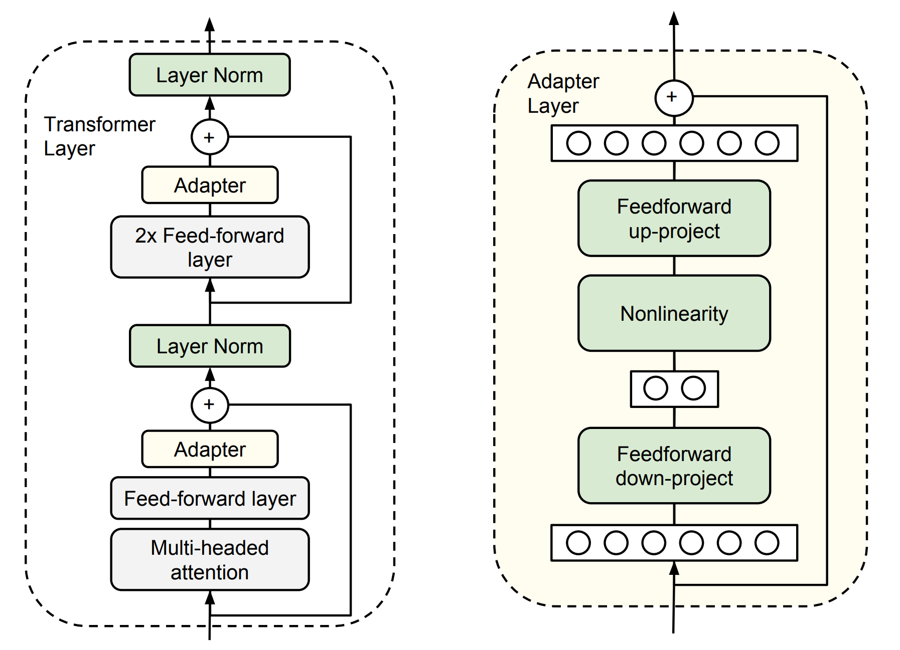
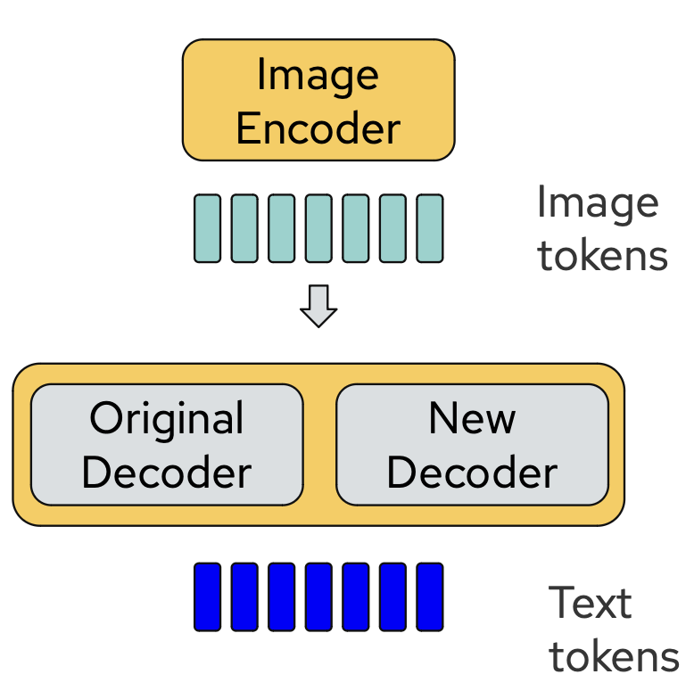
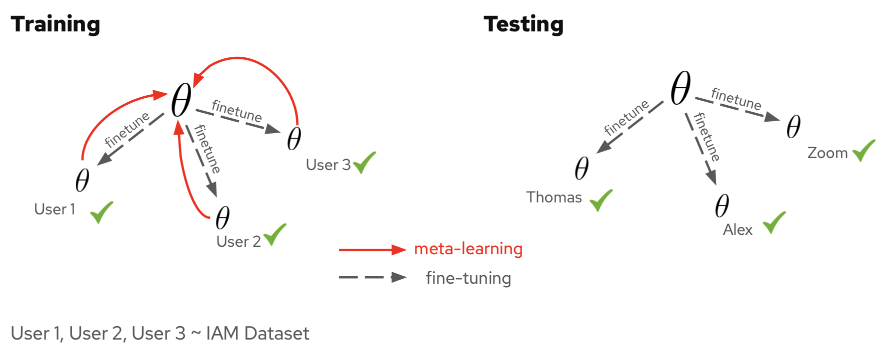
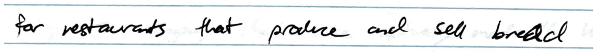
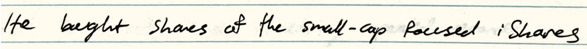

# 1. Introduction

Digital writing has experienced a significant surge in popularity among students, academics, and business professionals, thanks to the data processing capabilities of tablets and the enhanced precision of styluses. Utilizing tablets for note-taking allows users to effortlessly organize, share, and search their notes, with the latter function making use of optical character recognition (OCR) technology. OCR models harness tools from computer vision and machine learning, including convolutional neural networks and vision transformers. However, there exists an intriguing outlier amidst this digital revolution – Thomas Zeng.

<figcaption> Notability fails to recognizing Thomas's hand writting. </figcaption>

Thomas relies on his iPad and the popular app Notability for note management. However, his exceptionally messy handwriting poses a unique challenge: Notability's built-in OCR model struggles to decipher his notes, rendering them unsearchable. This issue extends beyond Notability; even sophisticated OCR models falter in deciphering Thomas's handwriting. While handwriting recognition is generally considered a solved problem, we contend that our situation presents a greater challenge due to its lack of clarity – even humans find it difficult to decipher Thomas's writing.

As good friends, we took it upon ourselves to address this dilemma. Our project's primary objective became clear: to develop a model capable of accurately recognizing Thomas's handwriting. More broadly, we aim to design a handwriting recognition system that surpasses human capabilities. To achieve this ambitious goal, we explored five distinct approaches in building such a model.

# 2. Preliminaries

## Datasets

### Thomas and Alex's handwriting

To capture Thomas' handwriting style accurately, we assembled a dataset comprising 60 images of sentences he had written. Of these, 50 images are allocated for training across our various approaches, while the remaining 10 are reserved for testing purposes. As a control, we also compiled a secondary dataset featuring sentences written by Alex, whose handwriting is notably clearer and easier to interpret.

<figcaption> Top: example of Alex's handwriting. Bottom: example of Thomas's handwriting.</figcaption>

### IAM dataset

For training-based approaches, we also consider using IAM dataset [1]. The IAM dataset comprises an extensive collection of handwritten samples contributed by 657 individual writers. It encompasses 1,539 scanned pages of text, featuring 5,685 accurately labeled isolated sentences. This dataset has been widely used in various state-of-the-art OCR methods [2].

<figcaption> Example of handwriting in IAM dataset. Figure is from [1].</figcaption>

## Evaluation metrics - character error rate

To evaluate each of our approaches we used the character error rate or CER of our predictions. CER is a common metric in natural language processing tasks and is a measure of what percent of the sentence did the model correctly predict. Because a model can make predictions far longer than the true label, the CER can be arbitrarily large for poor predictors. For reference a good OCR model typically achieves a CER of around ~0.02. However, on Thomas' handwriting, some of these same models had a CER > 1.

<figcaption> Character Error Rate (CER). </figcaption>

## Baseline -TrOCR

In this project, we consider TrOCR [2] as our baseline. TrOCR is a transformer-based model for end-to-end text recognition. It consists of an image Transformer encoder and an autoregressive text Transformer decoder, see figure below. The TrOCR model that is pretrained on IAM dataset is avalable on HuggingFace (<a src="microsoft/trocr-small-handwritten"> microsoft/trocr-small-handwritten </a>).

<figcaption> Overview of TrOCR architecture. The model consists of an image Transformer encoder and an autoregressive text Transformer decoder. Figure is from [2].</figcaption>

# 3. Methods

In this sections, we describe five approaches that we have tried to improve the performance of the TrOCR in recognizing illegible handwriting.

## Aprroach 1 - Naive finetuning

Our first approach was to fine-tune the baseline on Thomas' handwriting with the hope that the model could adapt quickly. In order to enable more efficient fine-tuning we also ran experiments where we frooze all of the weights in the encoder while keeping the decoder weigths trainable. Results are reported in Table 1. The results demonstrate that Thomas' dataset is both visually more difficult for humans and quantitatively more difficult for the OCR model than Alex's dataset. We also see that freezing the encoder facilitates more efficient fine-tuning in all instances. However, the performance is still far away from what we would hope for in an OCR model.

    <table class="center" style="width: 50%; flex: 1;">
        <tr>
            <th>Finetune</th>
            <th>Dataset</th>
            <th>CER</th>
        </tr>
        <tr>
            <td>None</td>
            <td>Thomas</td>
            <td>5.06</td>
        </tr>
        <tr>
            <td>Entire model</td>
            <td>Thomas</td>
            <td>0.84</td>
        </tr>
        <tr>
            <td>Decoder</td>
            <td>Thomas</td>
            <th>0.65</th>
        </tr>
        <tr>
            <td>None</td>
            <td>Alex</td>
            <td>3.10</td>
        </tr>
        <tr>
            <td>Entire model</td>
            <td>Alex</td>
            <td>0.79</td>
        </tr>
        <tr>
            <td>Decoder</td>
            <td>Alex</td>
            <th>0.34</th>
        </tr>
    </table>
    <figcaption> Table 1: Results of naive finetuning TrOCR model on Thomas and Alex's handwriting.</figcaption>

We also varied the number of images used in fine-tuning to see how much data was needed to adapt to a new writer. Results are shown in Table 2. As we expected, the performance consistently improves as we increase the number of training samples, suggesting that the TrOCR model benefits from abundant supervision.

    <table class="center" style="width: 50%; flex: 1;">
        <tr>
            <th># of Images</th>
            <th>Best CER (Thomas)</th>
        </tr>
        <tr>
            <td>50</td>
            <th>0.65</th>
        </tr>
        <tr>
            <td>20</td>
            <td>0.89</td>
        </tr>
        <tr>
            <td>10</td>
            <td>0.92</td>
        </tr>
        <tr>
            <td>5</td>
            <td>1.74</td>
        </tr>
        <tr>
            <td>1</td>
            <td>2.62</td>
        </tr>
    </table>
    <figcaption> Table 2: Results of varying number of labeled samples in finetuning the TrOCR model.</figcaption>

## Aprroach 2 - Supervised domain adaptation
For this approach, our motivation is that the features of unseen handwriting might have substantially different statistics from those of the data that the model have been trained on. This can be seen as a supervised domain adaptation where we seek to mitigate the statistical gap between seen and unseen data. We consider one of the most popular domain adaptation method: tuning the norm layers of the network [3], see figure below. After tuning, the model is native to the features of the handwriting of the target user.

<figcaption> LayerNorm-tuning. Figure is from [3].</figcaption>

In this experiments, we try to tune different norm layers of the TrOCR model. From Table 3, tuning all norm layers of the model produces the best performance, compared to just tuning the norm layers in the decoder. However, the overall effect of this approach is insignificant.

    <table class="center" style="width: 70%; flex: 1;">
        <tr>
            <th>Tuned Layers</th>
            <th>Dataset</th>
            <th>CER</th>
        </tr>
        <tr>
            <td>None</td>
            <td>Thomas</td>
            <td>5.06</td>
        </tr>
        <tr>
            <td>Decoder norm layers</td>
            <td>Thomas</td>
            <td>3.99</td>
        </tr>
        <tr>
            <td>All norm layers</td>
            <td>Thomas</td>
            <th>3.02</th>
        </tr>
        <tr>
            <td>None</td>
            <td>Alex</td>
            <td>3.10</td>
        </tr>
        <tr>
            <td>Decoder norm layers</td>
            <td>Alex</td>
            <td>2.44</td>
        </tr>
        <tr>
            <td>All norm layers</td>
            <td>Alex</td>
            <th>1.20</th>
        </tr>
    </table>
    <figcaption> Table 3: Results of tuning the LayerNorms to Thomas and Alex's handwriting.</figcaption>

## Aprroach 3 - Transfer learning
Transfer learning is closely related to our problem in the sense that we are trying to transfer a pretrained model to an downstream task of personalized text recognition. Finetuning all parameters of the model shows to be inefficient, see Table 1. Further, we are not sure if finetuning only decoder is the best approach in term of accuracy. As a result, in the third approach, we propose to train an adaptor in every transformer layer. This method has been widely used in various NLP and Vision tasks.

<figcaption> Adaptor is a trainable block integrated among original layers. Figure is from [4].</figcaption>

    <table class="center" style="width: 50%; flex: 1;">
        <tr>
            <th>Method</th>
            <th>Dataset</th>
            <th>CER</th>
        </tr>
        <tr>
            <td>Baseline</td>
            <td>Thomas</td>
            <td>5.06</td>
        </tr>
        <tr>
            <th>Adaptor</th>
            <td>Thomas</td>
            <th>0.72</th>
        </tr>
        <tr>
            <td>Baseline</td>
            <td>Alex</td>
            <td>3.10</td>
        </tr>
        <tr>
            <th>Adaptor</th>
            <td>Alex</td>
            <th>0.52</th>
        </tr>
    </table>
    <figcaption> Table 4: Results of trasfer learning mechanism on Thomas and Alex's handwriting.</figcaption>

While finetuning the adaptors does improve the performance of the baseline, it underperforms finetuning the decoder.

## Aprroach 4 - Dual-decoder
While fine-tuning the decoder of the TrOCR model, we suspected that it might be prone to overfitting due to the limited labeled samples of the target writer. To mitigate the risk of overfitting, we propose the utilization of a dual-decoder approach. This involves incorporating two decoders, each functioning as an expert in making predictions. In this setup, the first decoder remains frozen during fine-tuning, thereby preserving the prior knowledge acquired during the pretraining phase. Meanwhile, the second decoder is fine-tuned using the new data samples. By combining the logit values predicted by both decoders, we generate the final prediction for the text tokens. An overview of the dual-decoder is shown below.

<figcaption> Overview of dual-decoder. A dual-decoder consists of two decoders of the same architecture, serving as two experts in making text predictions.</figcaption>

    <table class="center" style="width: 50%; flex: 1;">
        <tr>
            <th>Model</th>
            <th>Dataset</th>
            <th>CER</th>
        </tr>
        <tr>
            <td>Baseline</td>
            <td>Thomas</td>
            <td>5.06</td>
        </tr>
        <tr>
            <th>Dual-decoder</th>
            <td>Thomas</td>
            <th>0.62</th>
        </tr>
        <tr>
            <td>Baseline</td>
            <td>Alex</td>
            <td>3.10</td>
        </tr>
        <tr>
            <th>Dual-decoder</th>
            <td>Alex</td>
            <th>0.71</th>
        </tr>
    </table>
    <figcaption> Table 5: Results of adopting a Dual-decoder in finetuning to Thomas and Alex's handwriting.</figcaption>

We can see that the Dual-decoder, to some extent, mitigates the overfiting issue, outperforming previous approaches.

## Aprroach 5 - Meta learning
In practical scenarios, it's crucial for the model to quickly adapt to diverse handwriting styles exhibited by various users. To this extent, we approach this challenge as a meta-learning task. Specifically, we consider adapting to the handwriting of a particular user as a small task. The model is meta-trained to enable rapid adaptation to any new task with just a few finetuning steps.

We employ Model-Agnostic Meta Learning (MAML) [5], a versatile framework for meta-training deep learning models. We meta-train the TrOCR model with MAML on the IAM dataset with the hope that the meta-trained model can easily adapt to Thomas and Alex's handwriting as illustrated in the figure below.

<figcaption> We split the IAM dataset into handwritings of different users and use MAML [5], a meta learning methods, to pretrain the TrOCR model. The meta learning mechanism allows our model to easily adapted to handwriting of novel users, e.g., Thomas and Alex.</figcaption>

We compare the effect of MAML and conventional training in the table below. As can be seen, MAML significantly improve the performance of the TrOCR model on Thomas and Alex's handwriting.

    <table class="center" style="width: 80%; flex: 1; white-space: nowrap;">
        <tr>
            <th>
                
Checkpoint

            </th>
            <th>Dataset</th>
            <th>CER</th>
        </tr>
        <tr>
            <td>
                
Checkpoint from HuggingFace

            </td>
            <td>Thomas</td>
            <td>5.06</td>
        </tr>
        <tr>
            <td>
                
Checkpoint from HuggingFace + finetune full model

            </td>
            <td>Thomas</td>
            <td>0.84</td>
        </tr>
        <tr>
            <th>
                
MAML + finetune full model

            </th>
            <td>Thomas</td>
            <td>0.78</td>
        </tr>

        <tr>
            <td>
                
Checkpoint from HuggingFace + finetune decoder

            </td>
            <td>Thomas</td>
            <td>0.69</td>
        </tr>
        <tr>
            <th>
                
MAML + finetune decoder

            </th>
            <td>Thomas</td>
            <th>0.51</th>
        </tr>

        <tr>
            <td>
                
Checkpoint from HuggingFace

            </td>
            <td>Alex</td>
            <td>3.10</td>
        </tr>
        <tr>
            <td>
                
Checkpoint from HuggingFace + finetune full model

            </td>
            <td>Alex</td>
            <td>0.79</td>
        </tr>
        <tr>
            <th>
                
MAML + finetune full model

            </th>
            <td>Alex</td>
            <td>0.77</td>
        </tr>

        <tr>
            <td>
                
Checkpoint from HuggingFace + finetune decoder

            </td>
            <td>Alex</td>
            <td>0.34</td>
        </tr>
        <tr>
            <th>
                
MAML + finetune decoder

            </th>
            <td>Alex</td>
            <th>0.26</th>
        </tr>
    </table>
    <figcaption> Table 6: Results of TrOCR model on Thomas and Alex's handwriting after meta-trained on IAM dataset.</figcaption>

# 4. Qualitative results

We show the qualitative results of our best model on Alex's handwriting.

<figcaption> Prediction: for restaurants that produce and sellbread. Ground-truth: for restaurants that produce and sell bread</figcaption>

<figcaption> Predict: He bought shares of the small-cap. Ground-truth: He bought shares of the small-cap focused iShares.</figcaption>

# 4. Conclusion

# 5. References

[1] <b>A full English sentence database for off-line handwriting recognition.</b>  
    Marti, U-V and Bunke, Horst. In Proceedings of the Fifth International Conference on Document Analysis and Recognition, 1999, pp. 705--708.

[2] <b>Trocr: Transformer-based optical character recognition with pre-trained models.</b>  
   Li, Minghao and Lv, Tengchao and Chen, Jingye and Cui, Lei and Lu, Yijuan and Florencio, Dinei and Zhang, Cha and Li, Zhoujun and Wei, Furu. In Proceedings of the AAAI Conference on Artificial Intelligence, 2023, pp. 13094--13102.

[3] <b>Parameter-efficient tuning on layer normalization for pre-trained language models.</b>  
    Qi, Wang and Ruan, Yu-Ping and Zuo, Yuan and Li, Taihao. In arXiv preprint arXiv:2211.08682, 2022.

[4] <b>Parameter-efficient transfer learning for NLP.</b>  
    Houlsby, Neil and Giurgiu, Andrei and Jastrzebski, Stanislaw and Morrone, Bruna and De Laroussilhe, Quentin and Gesmundo, Andrea and Attariyan, Mona and Gelly, Sylvain. In International conference on machine learning, 2019, pp. 2790--2799.

[5] <b>Model-agnostic meta-learning for fast adaptation of deep networks.</b>  
    Finn, Chelsea and Abbeel, Pieter and Levine, Sergey. In International conference on machine learning, 2017, pp. 1126--1135.